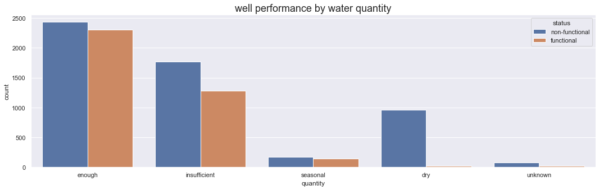
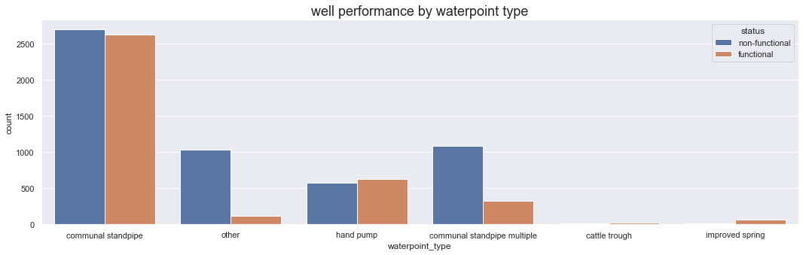
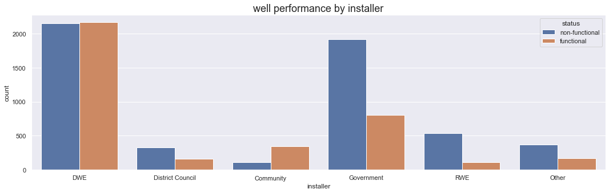

# Aaron Galbraith Flatiron Data Science Phase 3 Project

## Overview

The government of Tanzania funds roughly 9,000 water wells in Tanzania. We analyzed the available data on these wells and developed a model to predict which wells would fail based on the quantity of water available, the type of well, and the entity responsible for its installation. We make recommendations for action based on these findings as well as recommendations for further inquiry.

## Business and Data Understanding

### Business Understanding

A number of organizations install and manage water wells throughout the country of Tanzania to provide potable water to the population. Some of these wells become non-functional from time to time and need to be repaired or replaced. The government of Tanzania funds over 9,000 of these wells (about 15% of them).

Our analysis can help the government understand trends that are associated with wells that become non-functional. This can help the Tanzanian Government primarily in two ways.

1. The government can consider implementing changes in *how* (and *where*) they set up future wells so that wells have a better chance of remaining functional for a longer time without needing repair or replacement.

2. In the cases where these changes cannot be implemented, the government can more closely monitor wells that are likely to be at risk for needing repair or replacement.

### Data Understanding
The following will summarize the types of data that was available and 
#### Geographical Data
*E.g. elevation, longitude & latitude, basin (watershed), region, district, ward, etc.,*
Only a few of these location identifiers such as basin and region were ultimately included in modeling. We don't expect longitude and latitude to numerically trend with anything, and the elevation data we acquired turned out to be incomplete and unusable.
##### Location Distribution
Below, you can see the distribution of functional and non-functional wells throughout the country.

Here is how the wells performed by basin. (A "basin" is a geographical area whose water empties into a common lake, river, or sea.)

And here is how the wells performed by region.

#### Natural Conditions
*E.g. water quality, quantity, and source*
##### Water Quantity
The most important of these features was water quantity.

#### Well Structure
*E.g. extraction type and waterpoint type*
##### Waterpoint Type
Here is the performance by waterpoint type.

#### Installation and Management
*E.g. installer, permit status, identity of management group, payment arrangement, date of installation*

##### Installer

Here is the performance by installer.

##### Year of Construction

The following graph depicts the *failure* rate of wells over time (grouped by half-decades).

Unfortunately the data for construction year was far from complete — approximately 1/3 of records lacked values for this feature — so we were unable to include this predictor in formal modeling. However, we note the mostly-clear trend that more recently installed wells perform better.

## Modeling

We will develop models with two goals in mind. We wish to optimize overall accuracy in predicting whether wells will be functional or not, but also (and more importantly) we wish to optimize recall of non-functional wells. This means that we will favor models that correctly identify a higher percentage of non-functional wells. The reason for this preference is that we consider false negatives (labeling a non-functional well as functional, thus depriving people of drinking water by neglecting to repair or replace that well) a worse error than false positives (labeling a functional well as non-functional, thus diverting resources toward repairing or replacing a well that doesn't need it).

### Baseline: Logistic Regression
The baseline (logistic regression) model performed surprisingly well. Recall (of non-functional wells, the more important statistic) was 77.2%, and accuracy was 75.0%.

### Decision Tree Models

The models using decision trees (and bagged trees, and random forests) performed roughly as well as the baseline, but the *random forest* model outperformed all of them.

### Boost Models

The XG Boost model delivered the best overall accuracy by about 1%, but none of the models outperformed the random forest model in recall.

### Summary of Model Performance

| Model | Recall | Accuracy |
| -------- | ------- | ------- |
| Logistic Regression | 77.2% | 75.0% |
| Decision Trees (rough) | 76.3% | 72.0% |
| Decision Trees (tuned) | 74.2% | 75.2% |
| Bagged Trees | 77.7% | 76.6% |
| **Random Forest** | **80.9%** | **76.3%** |
| GridSearchCV | 75.0% | 77.2% |
| Adaboost | 78.1% | 75.0% |
| Gradient Boost | 78.6% | 75.7% |
| XG Boost | 77.7% | 78.3% |

## Evaluation

As all of the models delivered statistics in roughly the same range (recall: 74.2-80.9%; accuracy: 72.0-78.3%), it is fair to factor in all of their "feature importances". There was substantial consensus among the models that the three most important features were water quantity (particularly *dry*), waterpoint type (with a particular distinction between communal standpipe and communal standpipe *multiple*), and identity of the installer.

## Recommendations

Our recommendations are two-fold.

1. Insofar as the Government of Tanzania has the power of choice, it should

    a. install wells in areas that have sufficient water supply

    b. favor wells of *handpump* or *communal standpipe* waterpoint type

    c. delegate well installation to community workers or the DWE*

*We were unable to determine what entites the *DWE* or *RWE* were.

2. After wells have been installed, the government should allocate resources to monitor

    a. wells in areas with low water quantity

    b. wells of the "commual standpipe *multiple*" type

    c. wells that were installed by the RWE or by the government itself

    d. wells that were installed prior to 1985

## Further Inquiry

We would generally like to see better data gathering and fewer missing or uknown values. Most of all it would help to have more concrete data about the features most relevant to our results: water quantity, waterpoint type, and installer identity.

We could perform further analysis if we knew the cost and availability of certain options. For example, it would be helpful to know what the typical costs of the various waterpoint types are. In that case, we could advise which options are most effective *per dollar spent*.

## Links to PDFs

Find the notebook [here](https://github.com/aarongalbraith/flatiron-phase3-project/tree/main/deliverables/notebook.pdf)

Find the presentation [here](https://github.com/aarongalbraith/flatiron-phase3-project/tree/main/deliverables/presentation.pdf)

Find the github repository [here](https://github.com/aarongalbraith/flatiron-phase3-project/tree/main/deliverables/github.pdf)
